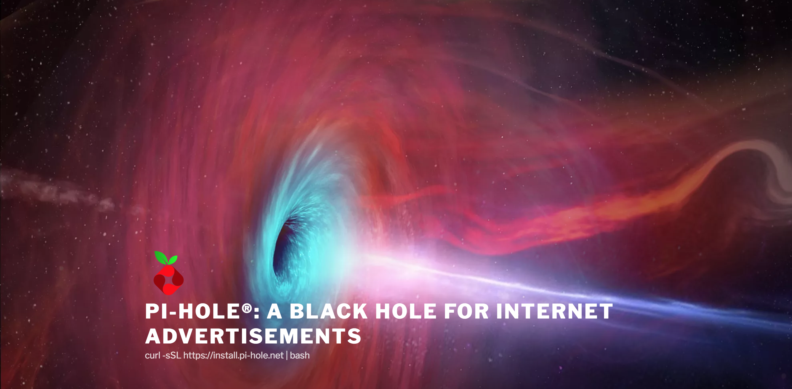

<section>
<!-- https://www.raspberrypi.org/ -->

</section>

<section>
<!-- https://www.reddit.com/r/raspberry_pi/comments/96ke4f/my_gamer_son_is_learning_how_merciless_the_old/ -->

</section>

<section>
<!-- https://www.reddit.com/r/raspberry_pi/comments/95n7fd/night_vision_zero_night_vision_goggles_for_less/ -->

</section>

<section>
<!-- https://forum.kodi.tv/showthread.php?tid=209343 -->

Music, Movies, TV Shows. Smart tv.
</section>

<section>
<!-- pi-hole.net -->

</section>

<section>
<!-- https://developer.amazon.com/docs/alexa-voice-service/set-up-raspberry-pi.html -->

Voice assistant
</section>

<section>
<!-- https://learn.adafruit.com/pigrrl-2/overview -->

</section>

<section>
<!-- https://howchoo.com/g/y2rhnzm3odz/control-your-3d-printer-with-octoprint-and-raspberry-pi -->

</section>

<section>
<!-- https://www.raspberrypi.org/ -->

</section>

<section>
<!-- https://www.reddit.com/r/raspberry_pi/comments/9637zg/raspi_used_in_robot_that_finds_waldo_with_ai/ -->
<video autoplay name="media">
	<source src="./static/waldo.webm" type="video/webm"/>
</video>
</section>

<section>

# Image sources

In order of presentation.

**Raspberry pi**
[raspberrypi.org/](https://www.raspberrypi.org/)

**Emulator**
[reddit.com/r/raspberry_pi/comments/96ke4f/my_gamer_son_is_learning_how_merciless_the_old/](https://www.reddit.com/r/raspberry_pi/comments/96ke4f/my_gamer_son_is_learning_how_merciless_the_old/)

**Night Vision**
[reddit.com/r/raspberry_pi/comments/95n7fd/night_vision_zero_night_vision_goggles_for_less/](https://www.reddit.com/r/raspberry_pi/comments/95n7fd/night_vision_zero_night_vision_goggles_for_less/)

**Mediacenter**
[forum.kodi.tv/showthread.php?tid=209343](https://forum.kodi.tv/showthread.php?tid=209343)

**Ad blocker**
[pi-hole.net](https://pi-hole.net)

**Voice Assistant**
[developer.amazon.com/docs/alexa-voice-service/set-up-raspberry-pi.html](https://developer.amazon.com/docs/alexa-voice-service/set-up-raspberry-pi.html)

**Pigirrl**
[learn.adafruit.com/pigrrl-2/overview](https://learn.adafruit.com/pigrrl-2/overview)

**Octopi**
[howchoo.com/g/y2rhnzm3odz/control-your-3d-printer-with-octoprint-and-raspberry-pi](https://howchoo.com/g/y2rhnzm3odz/control-your-3d-printer-with-octoprint-and-raspberry-pi)

**Camera Attachment**
[raspberrypi.org/](https://www.raspberrypi.org/)

**Waldo**
[reddit.com/r/raspberry_pi/comments/9637zg/raspi_used_in_robot_that_finds_waldo_with_ai/](https://www.reddit.com/r/raspberry_pi/comments/9637zg/raspi_used_in_robot_that_finds_waldo_with_ai/)

</section>
